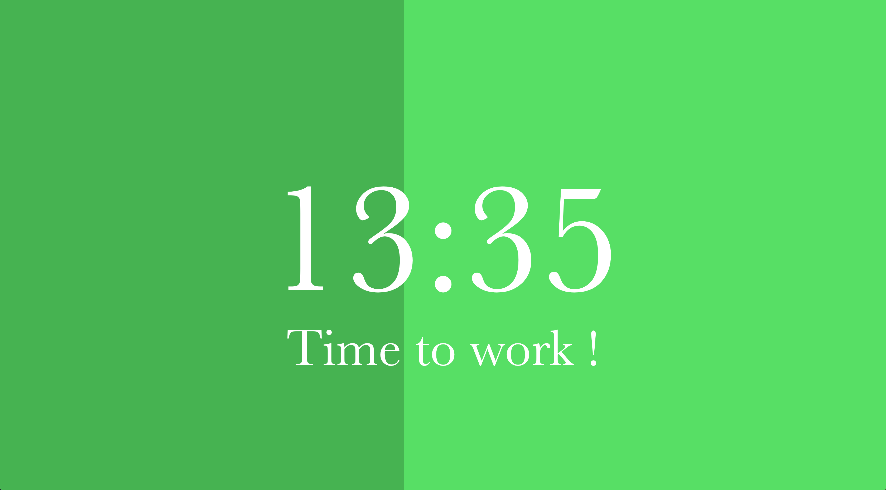
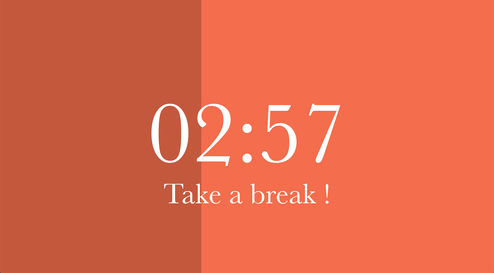

# Pomodoro.js
[Pomodoro.js](https://thatisapseudo.github.io/pomodoro_timer/) is a simple nice p5.js pomodoro timer to work more efficiently and gain productivity. Work duration is set to 25 minutes and break duration is set to 5 minutes.

At start, just hit the "START" button to launch the timer, *et voilà* ! To reset the timer, simply refresh the page.

Start page :

Pomodoro :

Break :

**/!\ Warning** : The timer MAY NOT work properly if the browser is out of focus when the timer reach 00:00 ; if this happens, the timer will simply wait until getting the focus back then start the next session. However, I'm planning on correcting this behaviour and add a sound to signal the end of a session.
Anyway, you can make anything else while the timer is running, just make sure to have it open when it's getting to 00:00.

Here is a list of behavior on different browsers/OS :

| OS | Browser | Pomodoro tab in focus | Browser in focus but other tab | Browser out of focus |
|----|---------|-----------------------|--------------------------------|----------------------|
| macOS | Firefox | Timer runs correctly | Timer runs correctly | Timer runs but will wait for browser focus at 00:00 to start next session |
| macOS | Chrome (Vivaldi, Chromium,...) | Timer runs correctly | Timer runs but will wait for browser focus at 00:00 to start next session | Timer runs but will wait for browser focus at 00:00 to start next session |
| macOS | Safari | Not tested yet | Not tested yet | Not tested yet |
| Windows | Firefox | Not tested yet | Not tested yet | Not tested yet |
| Windows | Chrome | Not tested yet | Not tested yet | Not tested yet |
| Windows | Edge | Not tested yet | Not tested yet | Not tested yet |
| Windows | Internet Explorer | Not tested yet | Not tested yet | Not tested yet |

For smartphone :

| OS | Browser | Pomodoro tab in focus | Browser in focus but other tab | Browser in background | Screen off | 
|----|---------|-----------------------|--------------------------------|-----------------------|------------|
| Android | Brave | Timer runs correctly | Timer runs but will wait for browser focus at 00:00 to start next session | Timer runs but will wait for browser focus at 00:00 to start next session | Timer runs but will wait for browser focus at 00:00 to start next session |
| Android | Firefox | Not tested yet | Not tested yet | Not tested yet |

Let me know of any issue, I did not test it on every browser so I'll welcome any feedback.
